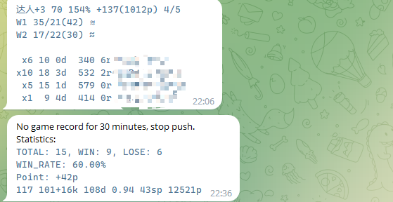
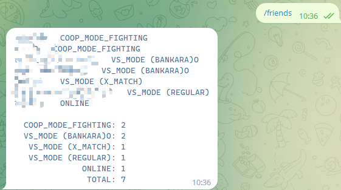

# sp3bot

Source code for [@splatoon3_bot](https://t.me/splatoon3_bot)

## Screenshot

### push mode

### post you data to [stat.ink](https://stat.ink/) every 3 hours

  
stop push

  

  
me

  

  
records

  

  
fest_records

  

  
my_schedule

  

  
friends

  

## Thanks

Thanks for providing the necessary algorithm API for account login.
* [s3s](https://github.com/frozenpandaman/s3s) ([@frozenpandaman](https://twitter.com/frozenpandaman))

Thanks for export battles to stat.ink
* [s3si.ts](https://github.com/spacemeowx2/s3si.ts)
